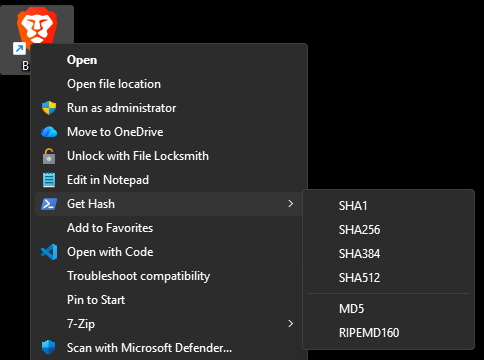

# hashfile-contextmenu-expanded

Adds file hash generation directly to Windows Explorer context menus.  
The hash value is copied to clipboard and displayed in a popup message.

Hash Algorithms: MD5, SHA1, SHA256, SHA384, SHA512, and RIPEMD160

# Modifications

This fork adds support for additional hash algorithms (SHA384, SHA512, and RIPEMD160). It also gets hash values in uppercase using the PowerShell `Get-FileHash` command instead of the original `certutil`, which returned values in lowercase.

Additional changes:
- Displays a popup message showing the copied hash value with algorithm confirmation
- Uses PowerShell icons in the context menu

## Install

**Cascading Menu:**  
Open `hashfile-contextmenu-add-all.reg` file to add a "Get Hash" context menu with all hash algorithms as submenu options.

**Individual Menu Entries:**  
Open individual files to add separate top-level menu entries:
- `hashfile-contextmenu-add-SHA1.reg` - Adds "Get SHA1" menu entry  
- `hashfile-contextmenu-add-SHA256.reg` - Adds "Get SHA256" menu entry
- `hashfile-contextmenu-add-SHA384.reg` - Adds "Get SHA384" menu entry
- `hashfile-contextmenu-add-SHA512.reg` - Adds "Get SHA512" menu entry
- `hashfile-contextmenu-add-MD5.reg` - Adds "Get MD5" menu entry
- `hashfile-contextmenu-add-RIPEMD160.reg` - Adds "Get RIPEMD160" menu entry

Restart the computer, or restart the `Windows Explorer` process from the Task Manager to apply changes.

## Uninstall

Open `hashfile-contextmenu-remove.reg` file to remove all context menu entries.
